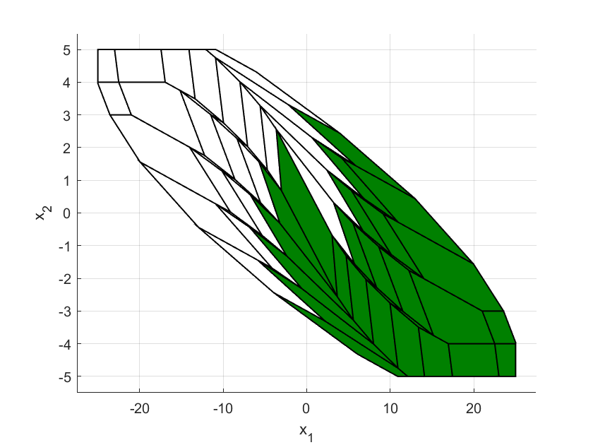

# pQP, pCLQOCP, and pCLQOCPsymm

The MATLAB classes **pQP**, **pCLQOCP** (subclass of pQP), and **pCLQOCPsymm** (subclass of pCLQOCP) represent parametric quadratic programs, constrained finite-horizon linear-quadratic optimal control problems, and symmetric constrained finite-horizon linear-quadratic optimal control problems, respectively. 

The classes implement multiple approaches [1-6] for determining  parametric solutions to quadratic programs that appear in predictive control. Most of these approaches are based on backward dynamic programming with active sets [7]. Additionally, the classes provide tools for the analysis of specific problems, e.g., plotting the state space partition of the solution, testing the validity of entered symmetries, or computing trajectories from a given initial state or active set.

## Getting Started

Download this repository from GitHub.

### Prerequisites

To use these classes, you need
* MATLAB
* Multi-parametric toolbox [1]

### Prepare

1. Open MATLAB.
2. Add the multi-parametric toolbox to your MATLAB path.
3. Add the files pQP.m, pCLQOCP.m, and pCLQOCPsymm.m to your MATLAB path.

Now you are ready to start!

## Using pQP, pCLQOCP, and pCLQOCPsymm

The following example will give a brief introduction to the classes **pQP**, **pCLQOCP**, and **pCLQOCPsymm**. The classes offer more possibilities to enter problems and more tools to analyze the problems. Make sure you check out the much more detailed MATLAB documentation by calling

	doc pQP
	doc pCLQOCP
	doc pCLQOCPsymm

### Creating an instance of class pCLQOCP

An object of **pCLQOCP** can be created for a constrained finite-horizon linear-quadratic optimal control problem with a discrete-time time-invariant linear system, a quadratic cost function, a finite prediction horizon, and linear state, input, and terminal constraints.

As an example, we use the double integrator system taken from [8]. First, we define the prediction horizon and the matrices that define the system, cost, and state and input constraints.

	A    = [1 1; 0 1];           % discrete-time time-invariant linear system x(k+1) = A*x(k) + B*u(k)  
	B    = [.5; 1];
	Q    = [1 0; 0 1];           % cost function x(N)'*P*x(N) + sum(k=0,...,N-1) x(k)'*Q*x(k) + u(k)'*R*u(k) 
	R    = .1;
	N    = 5;                    % prediction horizon
	Ox   = [0 1;0 -1;1 0; -1 0]; % state constraints are Ox*x(k) <= cx, k=0,...,N-1 
	cx   = [5 5 25 25]';
	Ou   = [1; -1];              % input constraints are Ou*u(k) <= cu, k=0,...,N-1 
	cu   = [1 1]';

Then, we call the constructor of class **pCLQOCP**.

	myQP1 = pCLQOCP(A,B,Q,R,[],Ox,cx,Ou,cu,[],[],N)

By defining the fifth, tenth, and eleventh input of the constructor as empty, the matrices of the terminal penalty P and terminal set Ot*x(N) <= ct are automatically set to the optimal cost function matrix of the unconstrained infinite-horizon problem, and to the largest possible set such that the optimal feedback matrix of the unconstrained infinite-horizon problem stabilizes the system without violating the constraints, respectively.

The code converts the problem into a parametric quadratic program with stagewise ordered constraints of the form min(U) 1/2*U'*H*U + x0'*F*U + 1/2*x0'*Y*x0 s.t. G*U <= w + E*x0 or equivalently, with augmented input z = U+inv(H)*F'*x0, min(z) 1/2*z'*H*z s.t. G*z <= w + S*x0. Matrices of the parametric quadratic program, the absolute number of constraints q, and the number of states n, inputs m, state and input constraints qUX, and terminal constraints qT are stored as properties of the object. The property solution is initialized as empty.

### Determining the parametric solution to the problem

The classes offer multiple approaches to determining the parametric solution. **pCLQOCP** implements the dynamic programming approach [3,4]. It can be called with

	myQP1 = myQP1.solveDP

The solution can also be determined using the multi-parametric toolbox [1] and the combinatorial approach from [2], both implemented in the class **pQP** which is the superclass of **pCLQOCP**, by calling

	myQP1 = myQP1.solveMPT
	myQP1 = myQP1.solveCombinatorial

The property `solution` then lists all active sets that define an affine piece in the solution in a logical matrix, where every line represents an active set expressed as a bit tuple (inactive constraints correspond to false, active constraints correspond to true).

To plot the solution, call

	myQP1.plotSolution

The figure that pops up illustrates the state space partition of the solution. The colors of the polytopes in the figure are described in a notification in the Command Window and depend on the activity of the constraints in the stages.

	
### Determining pointwise trajectories

To determine the open loop trajectory from a state x, call

	x = [-20; 3];
	[X,U,activeSet] = myQP1.computeOpenLoopTrajectory(x)

The open loop state and input trajectories and the optimal active set are then stored in X, U, and activeSet, respectively.

To determine the closed loop trajectory from an initial state x for `numberSteps` time steps, call

	numberSteps = 10;
	[xTraj,uTraj,activeSets,costTraj] = myQP1.computeClosedLoopTrajectory(x,numberSteps)

The closed loop state and input trajectories, the optimal active sets, and the cost function values, are then stored in `xTraj`, `uTraj`, `activeSets`, and `costTraj`, respectively.
	

To plot the states of the open- and closed loop trajectory as red circles and blue asterisks, respectively, in the parametric solution, call

	hold on
	plot(X(1,:),X(2,:),'ro')
	plot(xTraj(1,:), xTraj(2,:),'b*')

### Creating an instance of class pCLQOCPsymm

In case the symmetries of a constrained linear-quadratic optimal control problem are known (see [9] for more information), it is advantageous to implement the system as an object of **pCLQOCPsymm**. 

First, store all symmetric pairs (Theta,Omega) of the problem in the three-dimensional matrices allTheta and allOmega, where the i-th sheet of the matrices represents Theta and Omega of the i-th symmetric pair.

	allTheta(:,:,1) = eye(2); allTheta(:,:,2) = -eye(2);
	allOmega(:,:,1) = 1;      allOmega(:,:,2) = -1;

Then, call the constructor of class **pCLQOCPsymm**.

	myQP2 = pCLQOCPsymm(A,B,Q,R,[],Ox,cx,Ou,cu,[],[],N,allTheta,allOmega)

The properties are similar to the properties of the class **pCLQOCP** and extend it by the reduced solution `solutionReduced`, which contains only one active set out of each set of symmetric active sets in the solution, the number of symmetries `nSymm`, and the matrix `allTransformations` containing all constraint transformation matrices. The property `solutionReduced` is, like the property `solution`, initialized as empty.

To get a notification in the Command Window whether the inserted symmetries are indeed symmetries of the problem and satisfy group properties, call

	myQP2.testSymmetries

### Determining the parametric solution of the symmetric problem

To determine the properties solutionReduced and solution, call one of the following approaches

	myQP2 = myQP2.solveDP
	myQP2 = myQP2.solveMPT
	myQP2 = myQP2.solveCombinatorial

Here, the dynamic programming approach and the combinatorial approach are improved specially for symmetric problems [5,6].

The plot of the state space partition of the solution can be called with

	myQP2.plotSolution

Colors are defined differently to problems of class **pCLQOCP** described before and indicate the reduced part of the solution (only one polytope out of each set of symmetric polytopes) in green.
	

Other tools of **pCLQOCPsymm** remain unchanged to its superclass **pCLQOCP**.

## References

[1] M. Herceg, M. Kvasnica, C.N. Jones, and M. Morari. "[Multi-Parametric Toolbox 3.0](https://www.mpt3.org/ "website of multi-parametric toolbox")," 2013 European Control Conference (ECC): 502-510, 2013. DOI: 10.23919/ECC.2013.6669862  
[2] A. Gupta, S. Bhartiya, and P. S. V. Nataraj. "A novel approach to multiparametric quadratic programming." Automatica, 47(9): 2112-2117, 2011. DOI: 10.1016/j.automatica.2011.06.019  
[3] R. Mitze and M. Mönnigmann. "A dynamic programming approach to solving constrained linear-quadratic optimal control problems." Automatica, 120: 109132, 2020. DOI: 10.1016/j.automatica.2020.109132  
[4] R. Mitze and M. Mönnigmann. "Improved active set dynamic programming for solving linear-quadratic optimal control problems." 2022 IEEE 61st Conference on Decision and Control (CDC): 1764-1769, 2022. DOI: 10.1109/CDC51059.2022.9992397  
[5] R. Mitze, M. Kvasnica, and M. Mönnigmann. "Exploiting symmetries in active set enumeration for constrained linear-quadratic optimal control." Automatica, 151: 110900, 2023. DOI: 10.1016/j.automatica.2023.110900  
[6] R. Mitze and M. Mönnigmann. "Exploiting symmetries in tree-based combinatorial calculation of explicit linear MPC solutions." Accepted to the 24th International Conference on Process Control, 2023.  
[7] M. Mönnigmann. "On the structure of the set of active sets in constrained linear quadratic regulation." Automatica, 106: 61-69, 2009. DOI: 10.1016/j.automatica.2019.04.017  
[8] P. O. Gutman and M. Cwikel. "An algorithm to find maximal state constraint sets for discrete-time linear dynamical systems with bounded controls and states." IEEE Transactions on Automatic Control, 32: 251-254, 1987. DOI: 10.1109/TAC.1987.1104567  
[9] C. R. Danielson and F. Borrelli. "Identification of the symmetries of linear systems with polytopic constraints." 2014 American Control Conference (ACC): 4218–4223, 2014. DOI: 10.1109/ACC.2014.6859278

## Authors

* 2023, Ruth Mitze (ruth.mitze@rub.de) and Martin Mönnigmann (martin.moennigmann@rub.de), Ruhr University Bochum, [Systems Theory and Automatic Control](http://www.rus.ruhr-uni-bochum.de "homepage").

## License

This project is licensed under the GNU Lesser General Public License - see the LICENSE.txt file for details.

